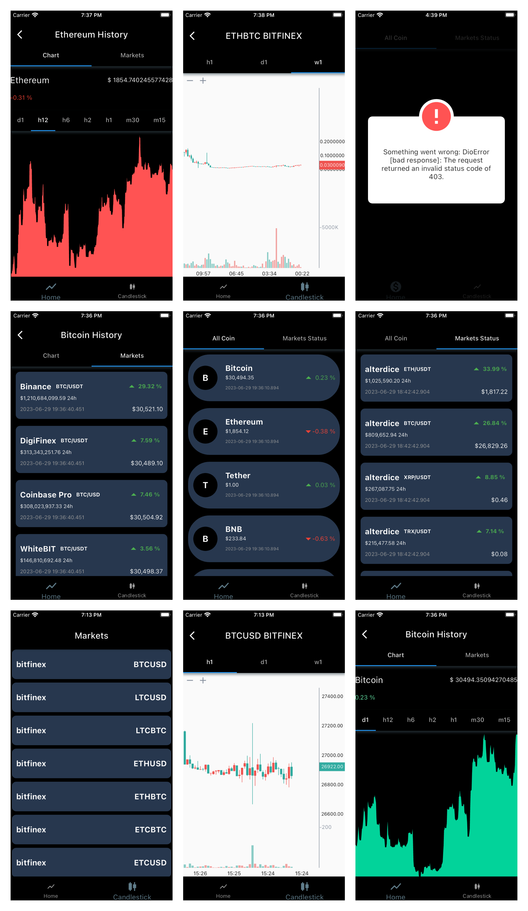

# cryptocurrency app

Flutter cryptocurrency application for showing some markets status and crypto prices with linear and candlestick chart with ability of time period filtering.

## Getting Started

Development subject:
- dio for api cal
- exception handling
- linear and candlestick charts
- clean architecture 
- time period filter
- bloc state management
- go_router bottom navigation bar with nested navigation and state persistance 
- get_it dependency injection

